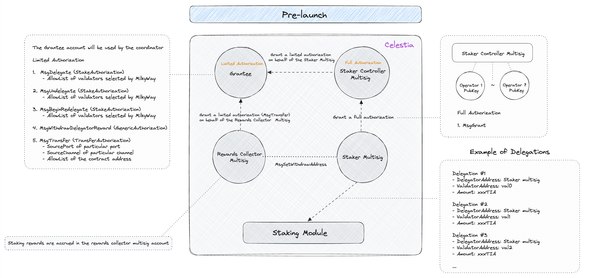
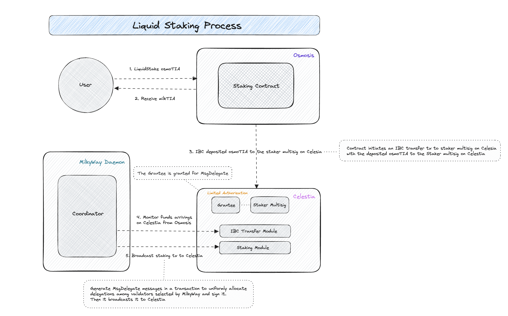
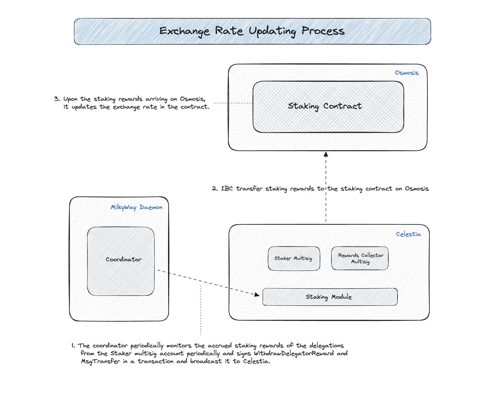
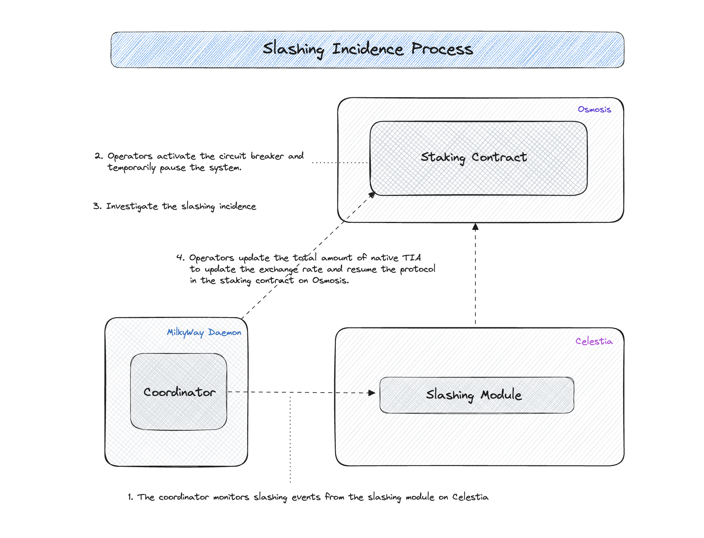

# Table of Contents

- [Overview](#overview)
    - [What is MilkyWay?](#what-is-milkyway)
    - [How does it work?](#how-does-it-work)
    - [Understanding Key Terms](#understanding-key-terms)
- [Diagram](#diagram)
    - [Preparation for launch](#preparation-for-launch)
    - [Liquid Staking Process](#liquid-staking-process)
    - [Withdrawal Process](#withdrawal-process)
    - [Exchange Rate Updating Process](#exchange-rate-updating-process)
    - [Validator Set Changes Process](#validator-set-changes-process)
    - [Operator Set Changes Process](#operator-set-changes-process)
    - [Slashing Incidence Process](#slashing-incidence-process)
    - [Compounding Staking Rewards Process](#compounding-staking-rewards-process)
- [Development](#development)
    - [CosmWasm Smart Contracts](#cosmwasm-smart-contracts)
    - [MilkyWay Daemon](#milkyway-daemon)

# Overview

This document serves as a comprehensive guide to understanding the underlying design and structure of MilkyWay.
It is intended to provide a clear and detailed description of the various components, systems, and technologies that make up our solution.
This document will be an essential resource for developers, operators, and anyone involved in the project, offering insight into the MilkyWay's architecture and how all the pieces fit together. Please feel free to reach out to the team if you have any questions or concerns.

## What is MilkyWay?

MilkyWay offers a liquid staking solution for the [Celestia](https://celestia.org/) ecosystem, and it will initially be deployed and operated on [Osmosis](https://osmosis.zone/) due to technical constraints that cannot be immediately addressed. When users stake their TIA coins with MilkyWay, they receive an on-chain representation of their TIA staking position, known as `stTIA`. This empowers Celestia token holders to access liquidity for their staked assets, enabling trading or their use as collateral in various DeFi products.

## How does it work?

At its core, MilkyWay uses CosmWasm contracts and a multisig custody system. It also leverages the Cosmos SDK authz module to introduce liquid staking derivative for Celestia ecosystem.

## Understanding Key Terms

Before diving into the technical architecture of MilkyWay, let's get comfortable with a few terms that will pop up:

- `TIA` is native coin on Celestia
- `osmoTIA` is IBC denomination for TIA sent to Osmosis blockchain
- `stTIA` is minted tokenfactory denom. It increases linearly against `osmoTIA` over time.
- Operators are trusted entities entrusted with the operation of the MilkyWay protocol, with each operator holding keys for all the multisigs used within the protocol.
- Validators are established Celestia validators who receive delegations from MilkyWay protocol.

# Diagram

The following diagrams for each process provide a visual representation of MilkyWay's data flow, These visual aids are designed to enhance the understanding of MilkyWay's technical architecture by simplifying complex concepts and illustrating how it works at its core.

## Preparation for launch

At launch, MilkyWay begins with 7 operators. Every operator needs to generate 3 accounts on Celestia and share their public keys. This information will be used to set up the following multi-signature accounts. It is essential that the generated accounts are securely stored in a vault with as low risk of compromise as possible.

1. `Staker multisig`
    - This account is configured as a 5-of-7 multisig, utilizing the public keys of the operators. It serves its purpose solely by granting full authorization to the staker controller multisig account. The full authorization means to grant privileges to grant and revoke to the staker controller multisig account on behalf of the staker.

2. `Staker controller multisig`
    - This account is configured as a 5-of-7 multisig, utilizing the public keys of the operators. It receives a full authorization from the staker multisig account and performs actions on behalf of the staker multisig account.

3. `Rewards collector multisig`
    - This account is configured as a 5-of-7 multisig, utilizing the public keys of the operators. It is primarily responsible for receiving staking rewards on behalf of the staker multisig account and is instrumental in enhancing accounting management.

There will be an account called `Grantee`, which will receive a limited authorization of the `Staker` multisig. The limited authorization prevents the `Grantee` from taking any actions that could have a detrimental impact on the protocol.

- Limited authorization includes:
    - `MsgDelegate`
        - Setting this authorization with an allow list of validators selected by the MilkyWay protocol.
        - Under this limited authorization, the grantee is permitted to delegate to the validators listed in the allow list.
    - `MsgUndelegate`
        - Setting this authorization with an allow list of validators selected by the MilkyWay protocol
        - Under this limited authorization, the grantee is permitted to undelegate from the validators listed in the allow list.
    - `MsgBeginRedelegate`
        - Setting this authorization with an allow list of validators selected by the MilkyWay protocol
        - Under this limited authorization, the grantee is permitted to redelegate among the validators listed in the allow list.
    - `MsgWithdrawDelegatorReward`
        - The `Grantee` is permitted to withdraw rewards from `the Staker` multisig.
    - `MsgTransfer`
        - Setting this authorization with the specific source port, channel and an allow list of the MilkyWay’s contract address.
        - Under this limited authorization, the grantee is permitted to ibc transfer the the addresses listed in the allow list.
    - `MsgRevoke`
        - This authorization is granted in the event that the `Grantee` account is compromised.

## Liquid Staking Process

We anticipate that TIA holders transfer their TIA from Celestia to Osmosis if they wish to use MilkyWay’s liquid staking derivative service.  Our front-end application will facilitate the IBC transfer from Celestia to Osmosis.

1. Let’s assume that a user initiates a request to liquid stake their `osmosTIA` into the CW staking contract on Osmosis.

2. The contract calculates how much `stTIA` to provide based on the exchange rate of `TIA`. Then it mints `stTIA` using the `tokenfactory` module of Osmosis and gives the user `stTIA` (staked TIA) as a tokenized representation of the staked TIA coin.

3. The contract constructs an IBC transfer transaction to the staker multisig account on Celestia and broadcast it.

4. The coordinator monitors the IBC transfer transactions from Osmosis on Celestia.

5. The coordinator generates `MsgDelegate` messages in a transaction to delegate uniformly across all MilkyWay validators using a private key of the grantee account (limited authorization) and broadcast it to Celestia.

## Withdrawal Process

1. Let’s assume that a user initiates a request to liquid unstake their `stTIA` into the CW staking contract on Osmosis.

2. The contract groups the unbonding request into a batch, which is then delivered to Celestia at the end of each batch period. By default, the batch period is 3 days.

3. The coordinator sends `MsgExecuteContract` transaction to execute the `submit_batch` in the staking contract to process awaiting undelegation requests in the current batch.

4. The coordinator generates `MsgUndelegate` messages in a transaction to undelegate uniformly across all MilkyWay validators and sign it with the grantee’s account. Then it broadcasts the signed transaction to Celestia.

5.  Wait for an unbonding period of 21 days

6. Unbonded amount is unlocked from the staking pool

7. The coordinator monitors undelegation events and construct an IBC transfer transaction from Celestia to Osmosis with the unbonded amounts and sign it. Then the coordinator broadcasts it to Celestia.

8. After a successful IBC transfer on Osmosis, unbonded `osmoTIA` is expected to arrive on the staking contract. Users who submitted unbonding requests can now claim their `osmoTIA` with the accrued staking rewards.

## Exchange Rate Updating Process

During the delegation process, the deposited osmoTIA is transferred to Celestia to stake on behalf of the MilkyWay users. Once it is staked, Celestia protocol begins to accrue staking rewards every block. To update the exchange rate on the staking contract on Osmosis, it's the responsibility of operators to regularly claim rewards and send them back to the staking contract, thereby updating the exchange rate. In MilkyWay, it leverages the authz module to grant limited authorization to withdraw staking rewards to the grantee account from the staker multisig account and the grantee account has limited authorization to IBC transfer from the rewards collector multisig account.

1. The coordinator periodically monitors the accrued staking rewards of the delegations from the Staker multisig account and signs [`WithdrawDelegatorReward`](https://github.com/cosmos/cosmos-sdk/blob/v0.46.9/proto/cosmos/distribution/v1beta1/tx.proto#L20C7-L20C30) and `MsgTransfer` in a transaction and broadcast it to Celestia.

2. IBC transfer the withdrawn staking rewards to the staking contract on Osmosis

3. Upon the staking rewards arriving on Osmosis, the staking contract updates the exchange rate. This increases the value of `stTIA` over time.

## Validator Set Changes Process

It is important that you understand the difference between operators and validators in MilkyWay. Reference the “Definition” section to understand the difference between them. 

The CW staking contract on Osmosis has exec entry points called `AddValidator` and `RemoveValidator` to add or remove validator from the current validator set.

1. The coordinator monitors the staking contract and parse add/remove validators events.

2. The coordinator performs the following depending on validator addition / removal
    - Validator Addition Process
        - There will be selection process for new validator(s)
        - Request operators to sign `MsgGrant` (`StakeAuthorization`) to update `AllowList` that includes the new validator(s). The coordinator aggregates signatures and broadcast it to Celestia
        - Request operators to sign `MsgExecuteContract` to call `AddValidator` exec entry point in the staking contract on Osmosis. The coordinator aggregates signatures and broadcast it to Celestia
        - The coordinator rebalances the existing delegations by sending `MsgBeginRedelegate` messages in a transaction to allocate equal amounts to the newly added validator.
    - Validator Removal Process
        - Validators must provide at least one month's advance notice to the community if they wish to exit from the validator set. It is crucial that they remain within the active validator set and uphold uptime. If they become inactive and are removed from the validator set, the community will decide whether to exclude them from the MilkyWay validator set
        - Execute `RemoveValidator` exec entry point in the staking contract on Osmosis
        - The coordinator sends `MsgBeginRedelegate` messages in a transaction to redelegate all delegations to our remaining validators.
        - Request operators to sign `MsgGrant` (`StakeAuthorization`) to update `AllowList` that removes the validator(s).
        - We aggregate signatures and broadcast it to Celestia

## Operator Set Changes Process

In MilkyWay, we've designed a system that leverages the authz module to manage the process of changing the operator set.

- As long as we have 5 out of 7 signatures from operators, we can still generate the multi-signed transaction to change the staker controller multisig account.

## Slashing Incidence Process

In the event of slashing, the following process is expected to be processed.

- The coordinator detects slashing events every block.
- Operators sign `MsgExecuteContract` to activate the circuit breaker and temporarily pause the system.

- Investigate the slashing incident and take required measures including making an announcement, collaborating with other operators and partners, and putting up a vote to hear the community feedback and voice on the possibility of removing the validator from the MilkyWay validator set.

- Operators sign `MsgExecuteContract` to update the total amount of native TIA to update the exchange rate and resume the protocol in the staking contract on Osmosis.

## Compounding Staking Rewards Process

- The coordinator periodically monitors the accrued staking rewards of the delegations from the staker multisig account periodically and signs `WithdrawDelegatorReward` and MsgTransfer in a transaction and broadcast it to Celestia.

- IBC transfer the withdrawn staking rewards to the staking contract on Osmosis

- IBC transfer back to the staker multisig

- The coordinator monitors the IBC transfer transactions from Osmosis on Celestia.

- The coordinator generates `MsgDelegate` messages in a transaction to delegate uniformly across all MilkyWay validators using a private key of the grantee account (limited authorization) and broadcast it to Celestia.

# Development

**Our dedicated team of engineers is actively building the following contracts and program. We’re planning to open source them in the near future.**

## CosmWasm Smart Contracts

The MilkyWay's core contracts that will be deployed and operated on [Osmosis](https://osmosis.zone/).  

## MilkyWay Daemon

The MilkyWay daemon is an off-chain program written in Go that provides convenient functionalities for operators to use. Also, it contains coordinator program to coordinate between the Osmosis and Celestia.

